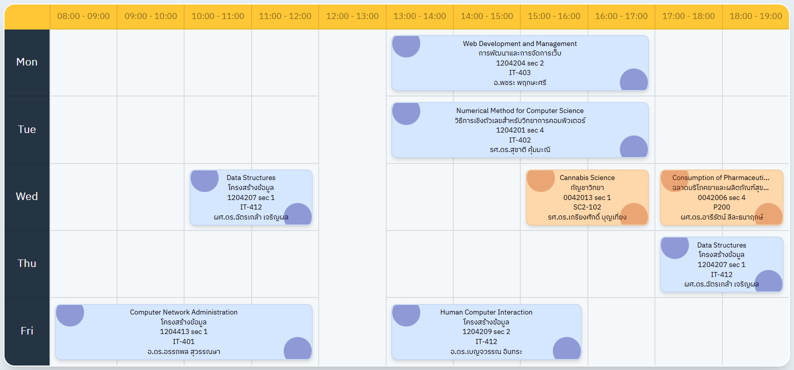

# ตารางเรียน (Talang Riean)

เว็บแอปพลิเคชันสำหรับแสดงตารางเรียนแบบอินเทอร์แอคทีฟ พัฒนาด้วย HTML, CSS (Tailwind CSS), และ JavaScript




## คุณสมบัติ

- แสดงตารางเรียนรายสัปดาห์
- ดีไซน์สวยงามและใช้งานง่าย
- Responsive Design รองรับทุกขนาดหน้าจอ
- คลิกที่วิชาเพื่อดูรายละเอียดเพิ่มเติม

## เทคโนโลยีที่ใช้

- **HTML5** - โครงสร้างหน้าเว็บ
- **Tailwind CSS** - Framework สำหรับออกแบบ UI
- **JavaScript (Vanilla)** - ตรรกะและการทำงานของแอป
- **SweetAlert2** - Modal สำหรับแสดงรายละเอียดวิชา
- **Font Awesome** - ไอคอนสำหรับลิงก์และ UI

## การติดตั้ง

1. Clone repository นี้:
```bash
git clone https://github.com/Minee25/talangriean.git
cd talangriean
```

2. ติดตั้ง dependencies:
```bash
npm install
```

3. Build Tailwind CSS (ถ้าต้องการแก้ไข styles):
```bash
npm run build
```

4. เปิดไฟล์ `public/index.html` ในเบราว์เซอร์

## โครงสร้างโปรเจกต์

```
talangriean/
├── public/
│   ├── assets/
│   │   ├── img/            # รูปภาพและโลโก้
│   ├── database/
│   │   └── info.js         # ข้อมูลตารางเรียน
│   ├── js/
│   │   ├── createTable.js  # ฟังก์ชันสร้างตาราง
│   │   └── script.js       # ฟังก์ชันหลัก
│   ├── src/
│   │   ├── input.css       # Tailwind input
│   │   └── output.css      # Tailwind output
│   └── index.html          # หน้าแรก
├── package.json
├── tailwind.config.js
└── README.md
```

## การใช้งาน

### เพิ่ม/แก้ไขข้อมูลตารางเรียน

แก้ไขไฟล์ `public/database/info.js` เพื่อเพิ่มหรือแก้ไขข้อมูลวิชา:

```javascript
const subjectList = [
  {
    id: "0",
    title: "ชื่อตารางเรียน",
    schedule: [
      {
        day: "Mon",
        classes: [
          {
            name: "ชื่อวิชา (ภาษาอังกฤษ)",
            nameThai: "ชื่อวิชา (ภาษาไทย)",
            time: "13:00 - 17:00",
            code: "1234567",
            section: 2,
            room: "IT-403",
            teacher: "อ.ชื่ออาจารย์",
            classRoomLink: "https://classroom.google.com/...",
            links: [
              "https://www.facebook.com/groups/...",
              "https://www.youtube.com/..."
            ],
            bg: "#D5E6FF",
            bgHover: "#000080",
            img: "teacher-image.jpg"
          }
        ]
      }
    ]
  }
];
```

### รูปแบบข้อมูล

- **day**: วันในสัปดาห์ (`"Mon"`, `"Tue"`, `"Wed"`, `"Thu"`, `"Fri"`)
- **time**: เวลาที่เรียน (รูปแบบ: `"HH:MM - HH:MM"`)
- **bg**: สีพื้นหลังของบล็อกวิชา (Hex color)
- **bgHover**: สีเมื่อ hover (Hex color)
- **img**: ชื่อไฟล์รูปภาพ (เก็บใน `public/assets/img/`)

### รองรับลิงก์ประเภทต่างๆ

ระบบจะตรวจจับและแสดงไอคอนอัตโนมัติสำหรับ:
- **Facebook Groups** - แสดงไอคอน Facebook สำหรับกลุ่ม
- **Facebook** - แสดงไอคอน Facebook ทั่วไป
- **LINE** - แสดงไอคอน LINE
- **YouTube** - แสดงไอคอน YouTube
- **อื่นๆ** - แสดงไอคอนลิงก์ทั่วไป

## การปรับแต่ง

### เพิ่มช่วงเวลา

แก้ไขอาร์เรย์ `time` ใน `public/js/createTable.js`:

```javascript
const time = [
  "08:00 - 09:00",
  "09:00 - 10:00",
  // เพิ่มช่วงเวลาที่ต้องการ
];
```

## การแก้ไขปัญหา

### รูปภาพไม่แสดง
- ตรวจสอบว่าไฟล์รูปภาพอยู่ใน `public/assets/img/`
- ถ้าไม่มีรูปภาพ ระบบจะใช้รูป fallback อัตโนมัติ

### ลิงก์ไม่ทำงาน
- ตรวจสอบว่า URL ถูกต้องและมี `http://` หรือ `https://`
- ตรวจสอบว่าเบราว์เซอร์ไม่บล็อก pop-up

## ผู้พัฒนา

พัฒนาโดย Thaksin Mualsuk

## ลิงก์ที่เกี่ยวข้อง
> "โปรเจกต์นี้จัดทำขึ้นจากความตั้งใจที่จะพัฒนาทักษะการเขียนโปรแกรม พร้อมทั้งสร้างเครื่องมือที่ช่วยให้การดูตารางเรียนเป็นเรื่องง่ายขึ้น โดยไม่มีวัตถุประสงค์เพื่อแสวงหาผลกำไรหรือการละเมิดลิขสิทธิ์แต่อย่างใด 🙏"

- [วางแผนการเรียน](https://www.planriean.com)

---

**หมายเหตุ**: โปรเจกต์นี้เป็นเว็บแอปพลิเคชันแบบ Static ไม่ต้องใช้เซิร์ฟเวอร์ สามารถเปิดใช้งานได้โดยตรงจากไฟล์ HTML
